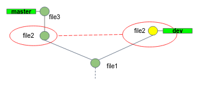

## Merge conflicts 

Occasionally, this process of merging doesn't go smoothly. 
If you changed the same part of the same file differently in the two branches you're merging, Git won't be able to merge them cleanly.

Let's simulate this scenario. 

1. Checkout branch `master`.
2. Create the following commits structure, as detailed below:   
   
   1. In branch `master` create a file called `file1` and commit it. 
   2. Check out a new branch called `dev`. In that branch create a file called `file2` with the below content and commit it:
      ```text
      Apple
      Banana
      Orange
      ```
   3. Checkout branch `master`, create a file called `file2` too, with the below content and commit it:
      ```text
      Apple
      Pear
      Orange
      ```
   4. This why the two commits are conflicted. 
   5. Create `file3` and commit it.
3. Now merge **`master` into `dev`**!

Git hasn't automatically created a new merge commit.
It has paused the process while ask you to resolve the conflict. 
If you want to see which files are unmerged at any point after a merge conflict, you can run `git status`. 

**Git stages all unconflicted files, while moves conflicted files to the working tree:** 


Git adds standard conflict-resolution markers to the files that have conflicts, so you can open them manually and resolve those conflicts.

Your `file2` contains a section that looks something like this:

```text
<<<<<<< HEAD:file2
Banana
=======
Pear
>>>>>>> master:file2
```

In order to resolve the conflict, you have to either choose one side or the other or merge the contents yourself.

4. After you've chosen the correct version, run `git add`. Staging the file marks it as resolved in Git.
5. Commit the change.
